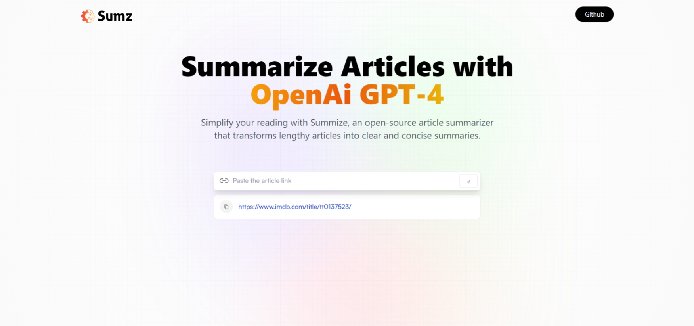

# Project AI Summarizer

* This project is a web application that uses Article [Extractor and Summarizer](https://rapidapi.com/restyler/api/article-extractor-and-summarizer?utm_source=youtube.com%2FJavaScriptMastery&utm_medium=referral&utm_campaign=DevRel) to summarize text.
* This is an API which extracts news/article body from a URL and uses GPT to summarize (and optionally translate) the article content. Useful for text mining purposes.

## Tech Stack

* Frontend: React
* Build Tool: Vite
* State Management: Redux

## Features

* Summarize text in a variety of languages
* Customize the summary length
* Save and share summaries

## Usage

1. Paste the text you want to summarize into the text box.
2. Click the "⏎" button.
3. The website will generate a summary of the text.
4. To copy the summary, click the copy button.

## Additional Details

* The frontend is built using React, a JavaScript library for building user interfaces.
* The website can summarize text in a variety of languages, including English, French, German, Spanish, and Portuguese.
* The user can customize the summary length by using a slider. The default summary length is 100 words.

## Contact

If you have any questions, please feel free to contact me.

Thank you for your interest!